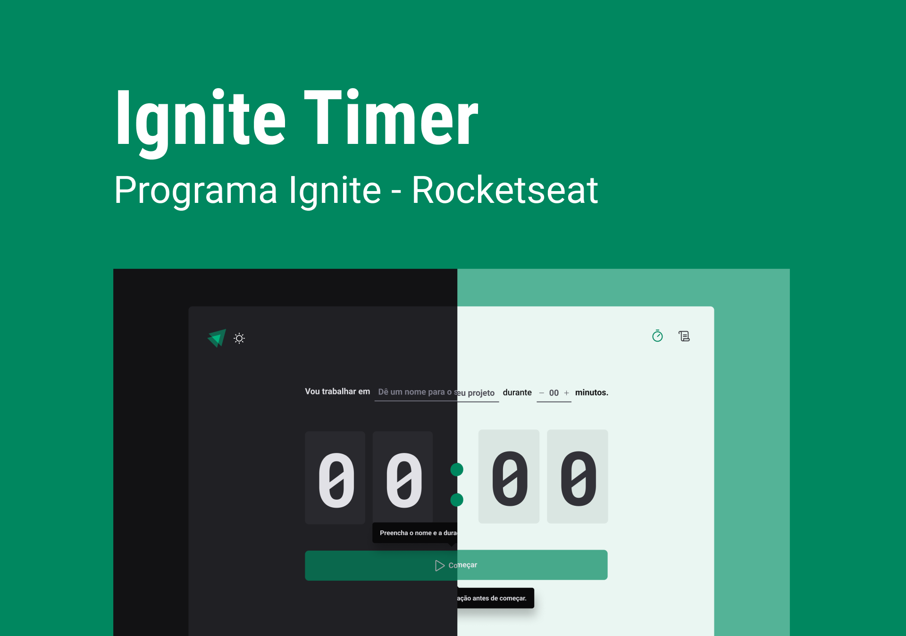

  <h1 align="center">
	Ignite Timer 🚀
  </h1>
  <h5 align="left">
	  🚀 Ignite Timer is an countdown application.
  </h5>
  <!-- <h5 align="left">
	  The application was developed during a week event of ReactJS development, 
    the functionallities were get to know about Context API, NextJS and Componentization.
  </h5> -->
  <!-- <h5 align="left">
	  As a developer I can never stop learning, I added some new functionallities to take
    the application to the next level, 
    the functionallities are Dark and Light mode of course, 
    ask to the user the time he wants in the countdown, loggin with github account, 
    salve the progress in the cookies, responsiveness.
  </h5> -->

# Tabela de conteúdos

<!--ts-->

- [About](#about)
- [How to run](#how-to-run)
  - [Requirements](#requirements)
- [Tecnologies](#technologies)
<!--te-->

## Getting Started

<!-- 

  <h2>Check the Final Application Here:</h2>
  ()

 -->

  <h2>This application is being built using the following technologies:</h2>
  
  - [React](https://pt-br.reactjs.org/)
  - [TypeScript](https://www.typescriptlang.org/)

  <h2>Features</h2>
  
    - [x] Inicia/Abandona ciclo de exercicio
    - [ ] Persiste informaçoes através de localStorage
    - [] Dark Mode

  <h2>Autor</h2>

 
  
 <b>Flavio Santos</b>

Built with ❤️ by Flavio Santos 👋🏽 get in touch!

